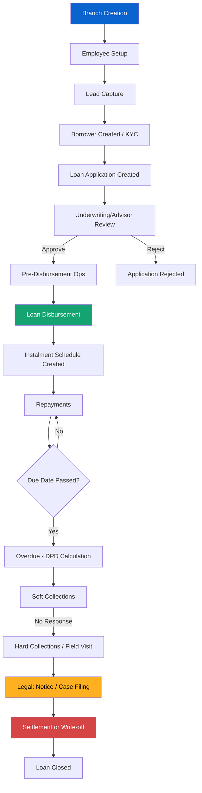

# Loan Management Workflow

## Process Flow

## Key Stages

1. **Lead Management**: Capture and convert leads
2. **KYC & Onboarding**: Verify borrower identity
3. **Loan Application**: Create and submit applications
4. **Approval**: Advisor reviews and approves
5. **Disbursement**: Operations team disburses funds
6. **Repayment**: Track EMI payments
7. **Collections**: Handle overdue accounts
8. **Legal**: Manage legal cases for defaults
